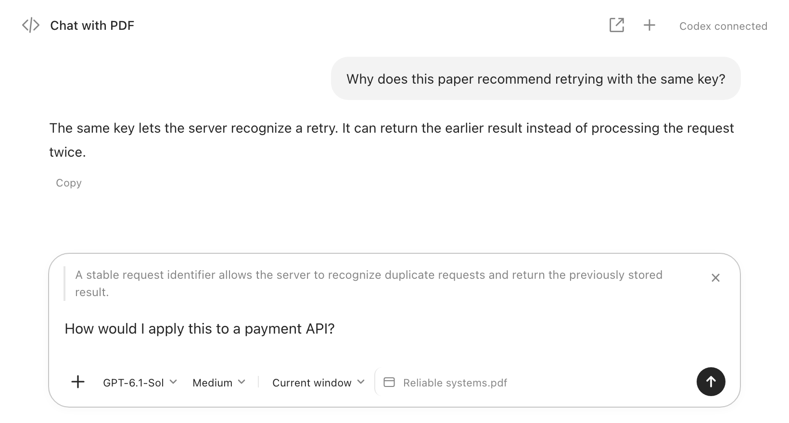

<h1>
  
  Tabgent
</h1>

**Your agent in every tab.**

Read, research, and get things done with Codex—right beside your tabs.

A Chrome sidebar with page context, visible tool activity, and a prewarmed Codex session for less waiting when you start a new conversation.

**macOS · Chrome 142+ · Uses your Codex login**

## Understand what you’re reading

Highlight a passage and ask a question. The quote and its page location travel with your message. Add screenshots, PDFs, or documents when you need more context.


## Chat with PDF

Online PDFs open in the built-in PDF.js viewer. Select a passage and it appears in Agent automatically, with its page and position. Ask Codex to explain or highlight it, then download a PDF with your annotations. You can also attach a PDF.



<sub>If PDF.js cannot load a document, Chrome’s native viewer remains available: direct text reading up to 10 MB, screenshots, and right-click **Quote in Agent**. Scanned pages require visual reading or OCR.</sub>

## Compare your open tabs

“Which plan is best for a team of five?” Let Codex read the live pages and compare them. Choose access to **this window** or **all browser windows**.


## Let the agent do the clicking

Fill forms, choose options, navigate, and inspect results. Follow the tool calls as they happen—and ask the agent to stop before submitting.


<sub>Screenshots show the actual extension UI with illustrative demo content, cropped to the relevant area.</sub>

Type **/** to choose a skill, set a goal, switch models or enter Plan mode. Expand the work log to inspect reasoning summaries, tool calls and progress.

## Why use this instead of the official extension?

The [official ChatGPT/Codex browser extension](https://learn.chatgpt.com/docs/chrome-extension) also offers side chat, selected-text context, and browser control. This project focuses on a customizable Codex workflow inside Chrome:

| What you want                       | Tabgent                                                                            |
| ----------------------------------- | -------------------------------------------------------------------------------------------------- |
| Discuss PDFs                        | Quote a passage from Chrome’s PDF viewer, or attach a PDF for page-by-page text reading.           |
| Less waiting to start               | Keeps a spare app-server session and, when signed in, a thread prewarmed.                          |
| More room for the same conversation | Open a full Agent tab; messages, drafts, and attachments stay synchronized with the sidebar.       |
| A fresh take on the same page       | **+** starts a new chat in place, keeping the same webpage and settings. |
| Control over the experience         | Open-source UI and connector; choose the model, reasoning effort, and window/browser scope.        |

Prewarming reduces startup work; it does not make model responses faster. No head-to-head speed benchmark is claimed. The official extension offers desktop-linked chats and broader app integrations; this project does not synchronize live conversations with Codex Desktop.

## Try it

Requires **macOS, Python 3.9+, Chrome 142+, and Codex installed and signed in**.

### Ask Codex to install it

Copy this into your Codex chat:

```text
Install Tabgent for me from:
https://github.com/FibonaAI/tabgent

Check that this Mac has Python 3.9+, Chrome 142+, and a compatible Codex
installation. Clone the repository into an unused local folder using my
existing GitHub access, read its installation instructions, and run
python3 extension/native/install.py from the repository root.

Use my existing CODEX_HOME and Codex sign-in. Open chrome://extensions,
enable Developer mode, load the installed extension from
${CODEX_HOME:-$HOME/.codex}/plugins/tabgent/extension,
and pin it. Use browser controls if available; otherwise guide me through
only the remaining clicks. Keep my existing Chrome profile and tabs.

Open the Agent sidebar and verify it connects to Codex. If repository
access, dependencies, or sign-in are missing, help me resolve that step
and continue. Tell me whether installation and connection are verified.
```

The repository is currently private; your GitHub account needs access. Chrome loading or Codex sign-in may require a few manual steps.

### Install manually

1. Download this repository and double-click **Install.command**.
2. Open `chrome://extensions`, enable **Developer mode**, then **Load unpacked** → `~/.codex/plugins/tabgent/extension`.
3. Pin the extension and click its icon. Start chatting beside any webpage.

[Installation help](docs/installation.md) · [Privacy & permissions](docs/privacy.md) · [Development](docs/development.md) · [Contributing](CONTRIBUTING.md)

<sub>Early preview. Page content and attachments used in a task are sent to your configured Codex service. Independent project, not affiliated with OpenAI or Google. [MIT license](LICENSE).</sub>
