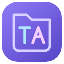
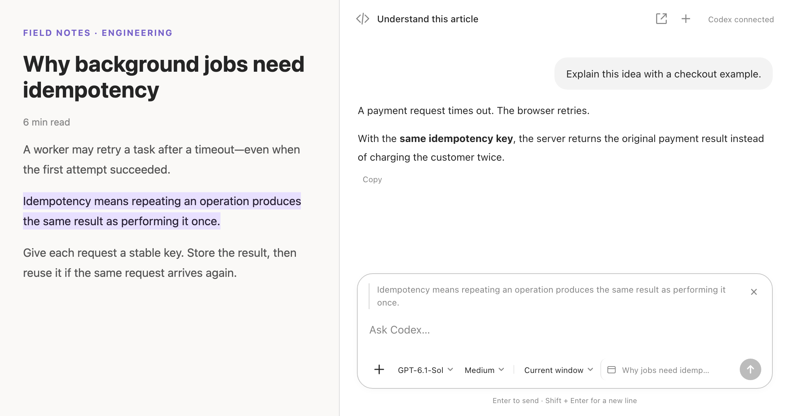
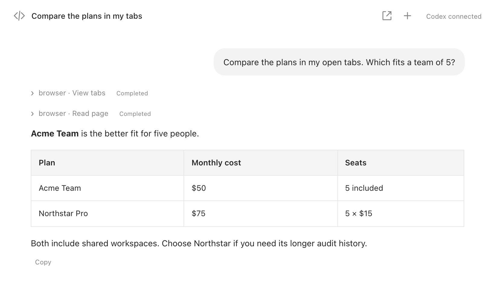
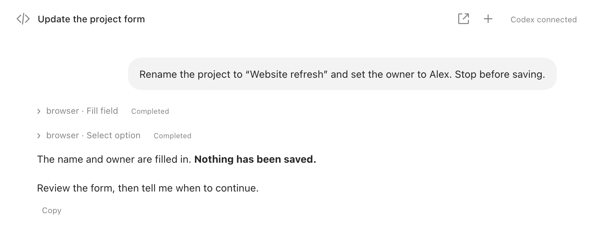

  

# Browser Agent Connector

**Read, research, and get things done with Codex—right beside your tabs.**

A Chrome sidebar with page context, visible tool activity, and a prewarmed Codex session for less waiting when you start a new conversation.

**macOS · Chrome 142+ · Uses your Codex login**

## Understand what you’re reading

Highlight a passage and ask a question. The quote and its page location travel with your message. Add screenshots, PDFs, or documents when you need more context.

## Compare your open tabs

“Which plan is best for a team of five?” Let Codex read the live pages and compare them. Choose access to **this window** or **all browser windows**.

## Let the agent do the clicking

Fill forms, choose options, navigate, and inspect results. Follow the tool calls as they happen—and ask the agent to stop before submitting.

Screenshots show the actual extension UI with illustrative demo content, cropped to the relevant area.

## Why use this instead of the official extension?

The [official ChatGPT/Codex browser extension](https://learn.chatgpt.com/docs/chrome-extension) also offers side chat, selected-text context, and browser control. This project focuses on a customizable Codex workflow inside Chrome:

| What you want                       | Browser Agent Connector                                                                            |
| ----------------------------------- | -------------------------------------------------------------------------------------------------- |
| Less waiting to start               | Keeps a spare app-server session and, when signed in, a thread prewarmed.                          |
| More room for the same conversation | Open a full Agent tab; messages, drafts, and attachments stay synchronized with the sidebar.       |
| A fresh take on the same page       | **+** creates an empty Agent tab with the same webpage, model, reasoning effort, and access scope. |
| Control over the experience         | Open-source UI and connector; choose the model, reasoning effort, and window/browser scope.        |

Prewarming reduces startup work; it does not make model responses faster. No head-to-head speed benchmark is claimed. The official extension offers desktop-linked chats and broader app integrations; this project does not synchronize live conversations with Codex Desktop.

## Try it

Requires **macOS, Python 3.9+, Chrome 142+, and Codex installed and signed in**.

1. Download this repository and double-click **Install.command**.
2. Open `chrome://extensions`, enable **Developer mode**, then **Load unpacked** → `~/.codex/plugins/browser-agent-connector/extension`.
3. Pin the extension and click its icon. Start chatting beside any webpage.

[Installation help](docs/installation.md) · [Privacy & permissions](docs/privacy.md) · [Development](docs/development.md) · [Contributing](CONTRIBUTING.md)

Early preview. Page content and attachments used in a task are sent to your configured Codex service. Independent project, not affiliated with OpenAI or Google. [MIT license](LICENSE).
