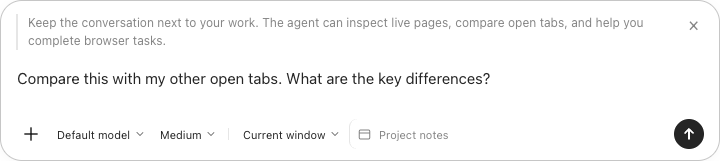

<p align="center">
  
</p>

<h1 align="center">Browser Agent Connector</h1>
<p align="center"><strong>Your tabs. Your context. Your agent.</strong></p>
<p align="center">Bring Codex into Chrome—with a conversation for each tab and tools that can work on the page beside you.</p>

Read a long article, compare open tabs, or work through a web task without copying
whole pages into a separate chat. Browser Agent Connector keeps the conversation
next to your work and lets Codex inspect the live page when it needs context.

**macOS · Chrome 142+ · Manifest V3 · English UI · Early preview**



_Composer preview using local demo content._

## What you can do

| Your workflow                   | How the extension helps                                                                                        |
| ------------------------------- | -------------------------------------------------------------------------------------------------------------- |
| Understand what you are reading | Quote selected text directly in the composer, with page and DOM location context.                              |
| Research across tabs            | Choose whether the agent can access the current window or all windows.                                         |
| Act on a page                   | Use browser tools to click, type, scroll, navigate, inspect frames, and take screenshots.                      |
| Keep the conversation nearby    | Toggle the sidebar or open the same conversation in an Agent tab.                                              |
| Bring your own context          | Paste images, drop files, or attach text, PDF, and DOCX files. Click thumbnails to inspect the original image. |
| See what the agent is doing     | Follow streaming replies, tool activity, results, and approval requests in the conversation.                   |

Try asking:

> “Explain this paragraph using the rest of the page as context.”
>
> “Compare the options in my open tabs and list the important differences.”
>
> “Fill this form using the details I provide, then let me review it.”

The extension preserves Chrome's native new-tab page. It does not replace your
browser, take over the address bar, or require a Chromium build.

## Get started

You need **macOS**, **Chrome 142 or later**, **Python 3.9+**, and a compatible
**Codex installation**. Node.js is only needed for development. The connector
uses Codex's existing authentication; you do not paste an API key into the extension.
Codex access and usage limits still apply.

1. Download or clone this repository, then open a terminal in its directory.
2. Install the local connector:

   ```sh
   python3 extension/native/install.py
   ```

3. Open `chrome://extensions`, enable **Developer mode**, and choose **Load unpacked**.
4. Select `~/.codex/plugins/browser-agent-connector/extension`.
5. Pin **Browser Agent Connector** to the toolbar. Click its icon to show or hide the Agent sidebar.

You can also double-click **Install.command** on macOS. If Codex is missing or
signed out, the chat shows setup guidance and checks for recovery automatically.

**Why a local connector?** Chrome extensions cannot launch Codex directly. A small
Python native-messaging host connects the extension to the local Codex app-server.
There is no additional hosted service operated by this project.

See [installation and troubleshooting](docs/installation.md) for updates, custom
`CODEX_HOME`, and compatibility details.

## A few details worth knowing

- **One conversation, two views.** Open the same Agent conversation in a new tab
  while keeping its sidebar. Messages, drafts and attachments synchronize, and
  the Agent tab retains the original webpage context. Closing either view keeps
  the conversation available in the other.
- **Start a fresh conversation on the same page.** The Agent’s **+** opens a new
  full-page Agent tab with the same linked webpage, model, reasoning effort and
  browser-control scope. History, drafts and attachments start empty. Chrome’s
  own `+` keeps its normal new-tab behavior.
- **Changing the page keeps the conversation.** Navigating or searching in the
  address bar does not replace the current tab's thread.
- **PDF selection uses a context menu.** Select text in Chrome's PDF viewer,
  then choose **Quote in Agent**. Chrome does not provide exact PDF selection
  coordinates through this interface.
- **Attachments are intentionally bounded.** Up to 10 files, 10 MB each. Image
  inputs support PNG, JPEG, WebP, and GIF. The file reader supports UTF-8 text,
  PDF text by page, and DOCX. Scanned PDFs have no OCR; other binary formats are
  not decoded.
- **This is an early preview.** Windows and Linux installation, full session
  pairing after a browser restart, and complete Codex Desktop feature parity
  are not implemented. Protected browser pages and native browser dialogs
  cannot be operated like regular websites. Human-verification challenges
  require the user.

## Your data and control

The agent reads live page content through scoped browser tools. The extension
does not automatically send every open page's body. Selected quotes, attachments,
and browser tool results can be sent to your configured Codex service as part of
requests; this is **not an offline AI**.

Conversations use the shared Codex home and the **Browser Agent Connector** project
at `~/.codex/projects/browser-agent-connector`. You can access those conversations
from a compatible Codex desktop app. Window/browser scope controls are enforced
by the extension; incognito tabs are excluded.

Read [data storage and permissions](docs/privacy.md) before using the extension
with sensitive pages. Review consequential actions before approving them.

## Develop and contribute

The extension is plain JavaScript, HTML, and CSS. The native connector uses the
Python standard library and macOS PDFKit. There is **no frontend build step**.

```sh
npm ci
npx playwright install chromium
python3 extension/native/install.py --dev
npm test
```

Load this repository's `extension/` directory in Chrome for development, or run
`npm run dev` to start an isolated Chrome for Testing instance. Frontend edits
load from source; native-host edits require rerunning the `--dev` installer.

| Command           | Purpose                                                               |
| ----------------- | --------------------------------------------------------------------- |
| `npm test`        | Static checks and isolated tests; no real model calls or credentials. |
| `npm run format`  | Format JavaScript, HTML, CSS, JSON, and documentation.                |
| `npm run package` | Build an installable source ZIP in `dist/`.                           |
| `npm run dev`     | Launch a dedicated development browser on macOS.                      |

Start with [CONTRIBUTING.md](CONTRIBUTING.md), the
[development guide](docs/development.md), or the [architecture](docs/architecture.md).
Bug reports with clear steps and small, focused pull requests are welcome.

## License and affiliation

Original project code is available under the [MIT License](LICENSE). See
[third-party notices](THIRD_PARTY_NOTICES.md) for Chromium-derived icons.

Browser Agent Connector is an independent project. It is not affiliated with,
endorsed by, or an official product of OpenAI or Google.
