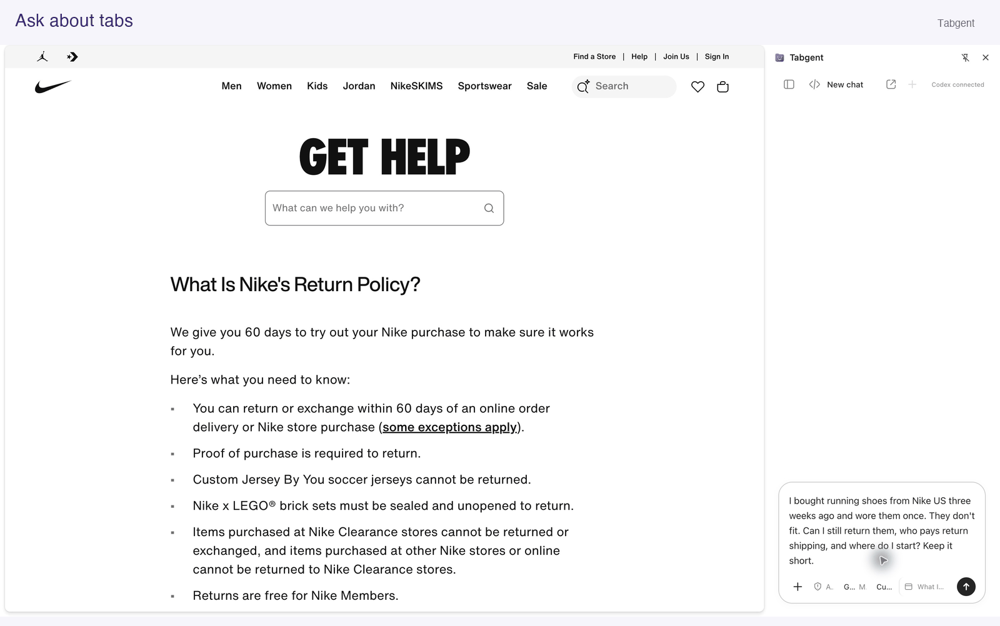
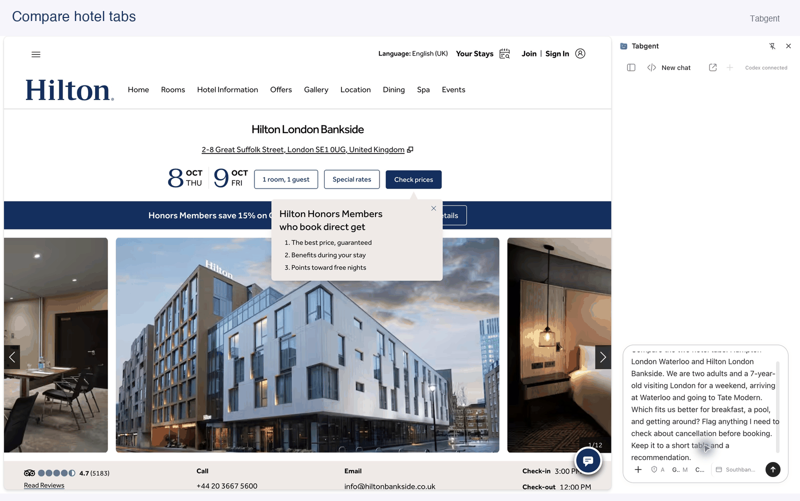
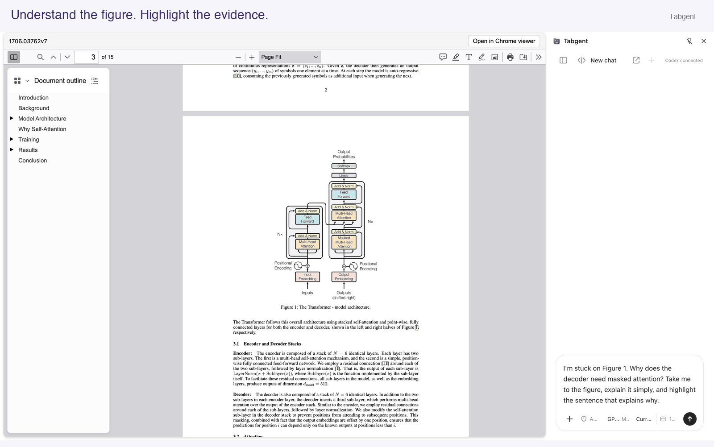
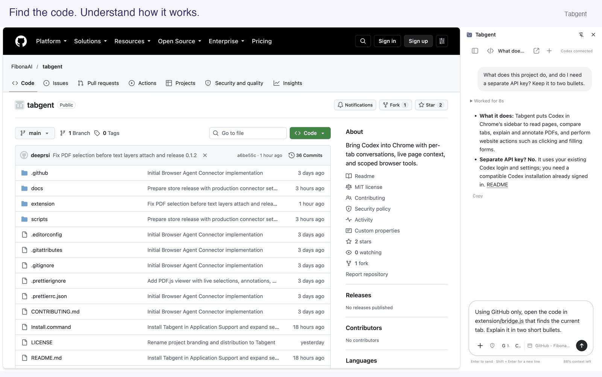
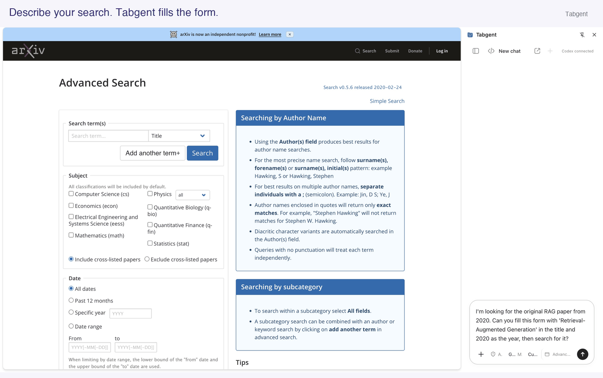
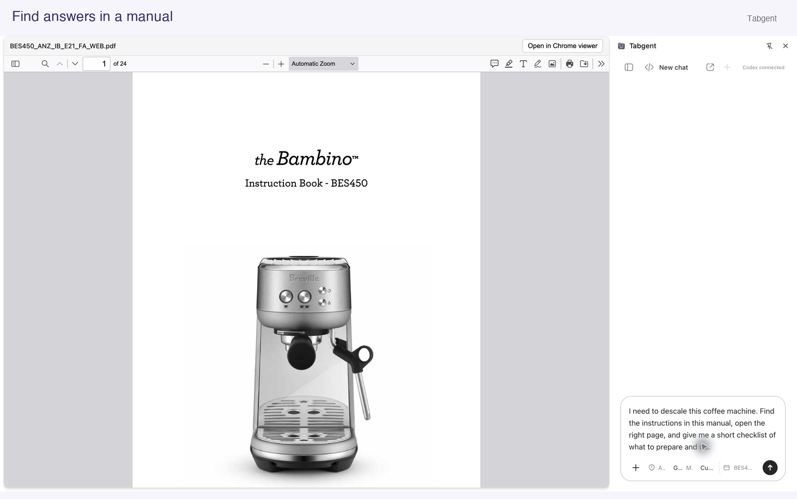
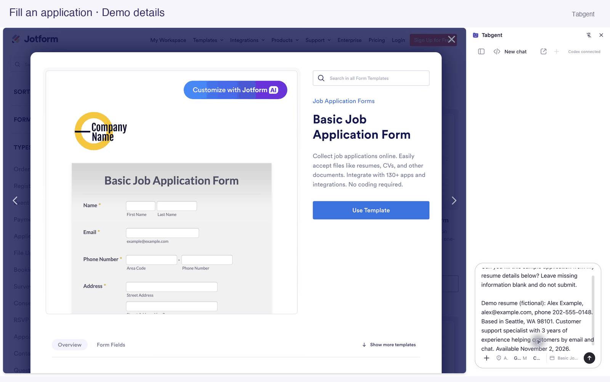
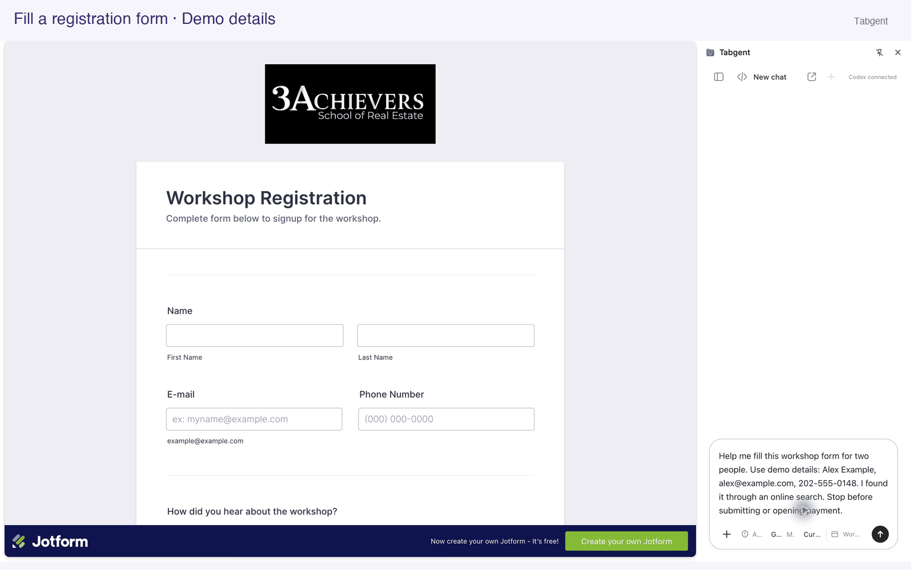
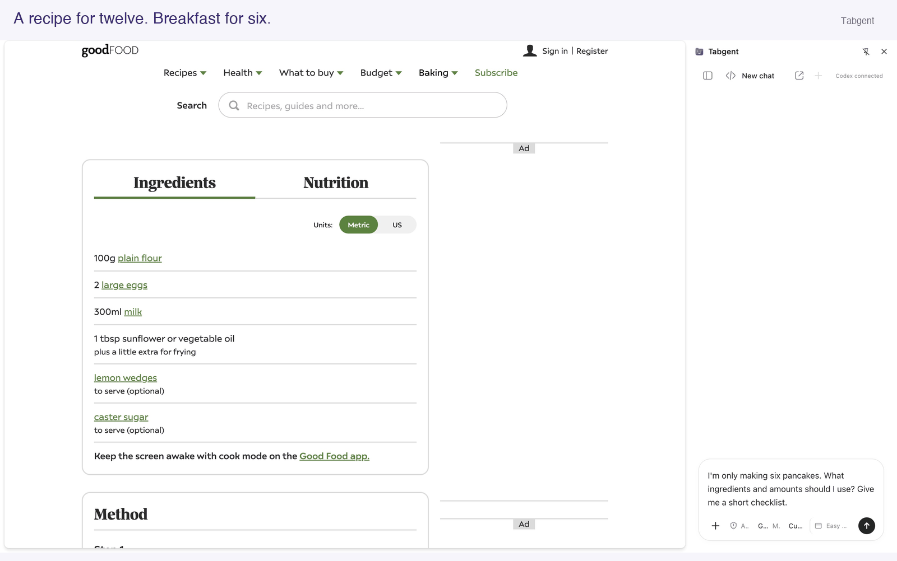
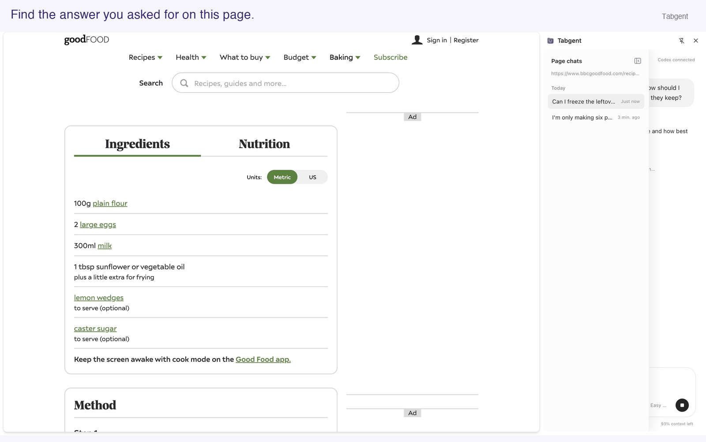

<h1>
  
</h1>

**Your agent in every tab.**

Tabgent is a Chrome extension that puts Codex in your browser sidebar. It can read the current page, compare tabs, explain and annotate PDFs, and click, fill forms or search websites for you.

[**Get started →**](#get-started) · [See it in action](#see-tabgent-in-action) · [Use cases](docs/use-cases.md)

**English** · [简体中文](README.zh-CN.md)

<sub>macOS · Chrome 142+ · Uses your Codex login · Open source under MIT · Early preview</sub>

## See Tabgent in action

Click any demo to view it full size.

<table>
  <tr>
    <td width="20%" align="center" valign="top">
      <a href="docs/assets/demos/11-ask-about-tabs.gif"></a><br>
      <strong>Ask about tabs</strong>
    </td>
    <td width="20%" align="center" valign="top">
      <a href="docs/assets/demos/12-hotel-comparison.gif"></a><br>
      <strong>Compare hotels</strong>
    </td>
    <td width="20%" align="center" valign="top">
      <a href="docs/assets/demos/04-pdf-explain-highlight.gif"></a><br>
      <strong>Read &amp; highlight papers</strong>
    </td>
    <td width="20%" align="center" valign="top">
      <a href="docs/assets/demos/03-github-code.gif"></a><br>
      <strong>Explore GitHub code</strong>
    </td>
    <td width="20%" align="center" valign="top">
      <a href="docs/assets/demos/05-fill-search-form.gif"></a><br>
      <strong>Fill search forms</strong>
    </td>
  </tr>
  <tr>
    <td width="20%" align="center" valign="top">
      <a href="docs/assets/demos/13-manual.gif"></a><br>
      <strong>Find steps in a manual</strong>
    </td>
    <td width="20%" align="center" valign="top">
      <a href="docs/assets/demos/14-job-application.gif"></a><br>
      <strong>Fill a job application</strong>
    </td>
    <td width="20%" align="center" valign="top">
      <a href="docs/assets/demos/15-event-registration.gif"></a><br>
      <strong>Fill a registration form</strong>
    </td>
    <td width="20%" align="center" valign="top">
      <a href="docs/assets/demos/07-recipe-quantities.gif"></a><br>
      <strong>Adjust a recipe</strong>
    </td>
    <td width="20%" align="center" valign="top">
      <a href="docs/assets/demos/10-page-history.gif"></a><br>
      <strong>Revisit past chats</strong>
    </td>
  </tr>
</table>

[More examples and feature details →](docs/features.md)

## More features

- **[File attachments](docs/features.md#give-tabgent-the-right-context):** Upload images, PDFs, Word documents (DOCX) or text files and ask questions about them alongside the current page.
- **[Chat history](docs/features.md#keep-your-chats-connected):** Find conversations for the current URL. Chats opened from links record their origin, so you can switch between related tabs. You can also open a chat in a full-page view.
- **[Follow-ups and task controls](docs/features.md#guide-a-task-as-it-runs):** Send messages while a task runs, use Steer to change the current task, or stop it. Edit or delete queued messages, and watch the pointer and activity log to see what is happening.
- **[Plans and goals](docs/features.md#guide-a-task-as-it-runs):** Use Plan mode, or set a task goal with an optional token budget. Goals can be paused and resumed.
- **[Models and permissions](docs/features.md#make-it-fit-your-work):** Choose a model, reasoning effort, approval mode and which browser windows Tabgent can use.
- **[Skills and tools](docs/features.md#make-it-fit-your-work):** Use skills, web search and services already configured in Codex. Copy answers or export conversation messages as Markdown.

Some features require a compatible Codex version, model or configuration.

## Other use cases

[Collect monthly invoices](docs/use-cases.md#collect-monthly-invoices-without-hunting-through-every-account) · [Fill a job application](docs/use-cases.md#apply-for-a-job-without-entering-your-resume-all-over-again) · [Compare rental listings](docs/use-cases.md#compare-rental-listings-without-losing-track-of-the-details)

[Prompts and instructions for seven use cases →](docs/use-cases.md)

These guides suggest ways to use Tabgent. The full workflows have not all been tested, and results depend on the website.

## Get started

### Requirements

- **macOS**, **Chrome 142+**, and **Python 3.9+**.
- **A compatible Codex installation, signed in.** See [compatibility details](docs/installation.md#requirements).
- Access to this GitHub repository while it is private.

Tabgent uses your existing Codex login and settings. It is not yet listed in the Chrome Web Store; installation requires loading the extension locally.

### Option 1: Ask Codex to install it

Copy this prompt into Codex:

```text
Install Tabgent from https://github.com/FibonaAI/tabgent.

Check that this Mac has Python 3.9+, Chrome 142+, and a compatible Codex
installation. Clone the repository into an unused folder using my existing
GitHub access, read docs/installation.md, and run:
python3 extension/native/install.py

Use my existing CODEX_HOME and Codex sign-in. Open chrome://extensions,
enable Developer mode, and load the unpacked extension from:
~/Library/Application Support/Tabgent/extension

Pin it and open the Agent sidebar. Keep my existing Chrome profile and tabs.
Use browser controls if available; otherwise guide me through the remaining
clicks. Help resolve missing access, dependencies, or sign-in, and verify
that the sidebar shows “Codex connected”. Report what you verified.
```

### Option 2: Install manually

1. Clone or download this repository.
2. Double-click **Install.command**, or run the following from the repository root:

   ```sh
   python3 extension/native/install.py
   ```

3. Open `chrome://extensions`, enable **Developer mode**, and choose **Load unpacked**. Select:

   ```text
   ~/Library/Application Support/Tabgent/extension
   ```

   The installation path stays the same if you use a custom `CODEX_HOME`; that setting only selects your Codex account, configuration and data directory.

4. Pin Tabgent, open a webpage, and click its toolbar icon. Once you see **Codex connected**, try: **“Summarize this page.”**

**Updating:** rerun the installer and reload Tabgent in `chrome://extensions` after active tasks finish. See [installation and troubleshooting](docs/installation.md) for connection problems, custom setups, and uninstall instructions.

## Privacy & control

- **Choose how actions are approved:** Ask for approval, Approve for me, or Full access.
- **Choose which windows the assistant can use:** the current window or all windows. This setting only limits Tabgent’s browser actions; it does not restrict other Codex tools or connected services.
- **Connects to your local Codex installation:** Tabgent connects to Codex on your Mac. There is no separate Tabgent cloud service processing your conversations.
- **Conversation content is sent to Codex:** to answer questions or carry out tasks, your messages, supplied page content and relevant attachments are sent to your configured Codex service. They are not processed solely on your computer.

Read [Privacy & permissions](docs/privacy.md) for data flow, storage locations, and Chrome permissions. Report security concerns using [SECURITY.md](SECURITY.md).

## Current limits

Tabgent is an early preview. **macOS and Chrome are the primary supported setup.** Some older Codex versions may need an update. Tabgent conversations do not synchronize live with Codex Desktop, and after a browser restart, saved conversations may no longer open their original tabs automatically.

## Contribute

Bug reports, suggestions and pull requests are welcome. Start with the [development guide](docs/development.md) and [contribution guidelines](CONTRIBUTING.md).

| Resource                                 | Contents                                     |
| ---------------------------------------- | -------------------------------------------- |
| [Installation](docs/installation.md)     | Setup, updates, troubleshooting, and removal |
| [Development](docs/development.md)       | Run locally, test, and package               |
| [Architecture](docs/architecture.md)     | Extension and native connector internals     |
| [Privacy & permissions](docs/privacy.md) | Data handling and access boundaries          |

This page and the user guide are available in English and Simplified Chinese. The technical guides above are currently in English.

## License

[MIT](LICENSE). Bundled dependencies retain their own licenses; see [third-party notices](THIRD_PARTY_NOTICES.md).

Tabgent is an independent project, not affiliated with OpenAI or Google.
