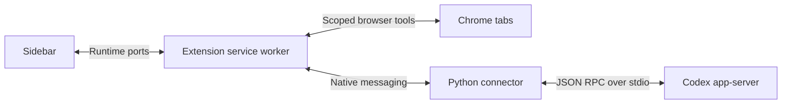

# Architecture

## Source map

| Path                              | Responsibility                                                              |
| --------------------------------- | --------------------------------------------------------------------------- |
| `extension/background.js`         | Tab/session ownership, native transport, selection routing.                 |
| `extension/bridge.js`             | Runtime port connecting a chat view to its owner tab.                       |
| `extension/browser-tools.js`      | Scope enforcement, browser actions, page reading and frame context.         |
| `extension/browser-input.js`      | CDP-based trusted input and coordinate actions.                             |
| `extension/selection-content.js`  | Selected text, DOM endpoints, offsets, and frame-relative geometry.         |
| `extension/session-config.js`     | Browser tool schema and agent instructions.                                 |
| `extension/ui/`                   | Chat rendering, composer, attachments, previews, approvals, and onboarding. |
| `extension/_locales/en/`          | English UI strings; i18n structure is retained.                             |
| `extension/native/host.py`        | App-server discovery, sessions, authentication events, and RPC transport.   |
| `extension/native/attachments.py` | Bounded uploads and text/PDF/DOCX reading.                                  |

Each webpage tab owns a session. Agent tabs share that session through runtime
ports and retain its original page context. The sidebar beside an Agent tab has
an independent session with the Agent tab as its context. The `agentViews` map
records ownership before the Agent page loads. Closing the source transfers
ownership to a remaining Agent tab; the native process closes with the final view.
A prewarmed spare reduces startup work. Full Agent tabs hide the expand button.

Chrome owns the toolbar's sidebar toggle. The Agent + button creates an independent
Agent tab that inherits the source session's page and settings, without copying
conversation content. View-only sessions close when their final Agent tab closes.
There are no webpage overlays, layout menus, or persisted layout preferences.

The service worker checks tool scope on every request. Selection messages derive
the owner tab and frame from Chrome's sender metadata, not a page-supplied tab ID.
DOM locations are historical hints and must be checked against the live page.
Online PDF documents in top-level tabs are redirected to a bundled PDF.js viewer
using a response-header declarative rule. The source URL and Chrome tab ID remain
the conversation context. PDF.js runs locally with PDF JavaScript disabled. It
provides text-layer selections with page numbers/PDF coordinates, page reads,
exact text selection, highlights, and annotated PDF downloads. The viewer's
native annotation tools also support manual comments and edits. Changes must be
downloaded to save a copy; they are not automatically persisted across reloads.

PDF viewer ports are validated by extension URL, tab, frame, and document ID;
Chrome hides extension documents from `webNavigation.getFrame`. Browser commands
are still checked against the selected tab/window scope. Vendor files and licenses
are in `extension/vendor/pdfjs`, with packaging details in its README.

A load failure or **Open in Chrome viewer** installs a tab/URL-specific session
allow rule before navigating back, preventing redirect loops. Other tabs continue
to use PDF.js. Embedded PDFs, POST responses, explicit attachment downloads, and
local files are not automatically redirected. Existing open PDFs use the new
viewer after reload unless that tab/URL has opted into native fallback.

The native fallback is retained: **Quote in Agent** sends a right-click quote
without reliable page coordinates. For HTTP(S) PDF tabs, `browser read` fetches
the original bytes in Chrome and sends them to PDFKit in the native host. These
reads are limited to 10 MB and temporary files are deleted. Screenshot, pointer,
keyboard, and scroll tools operate the native viewer directly. Neither text
reading path implements OCR for scanned pages.

## Working on the UI

Keep the bottom toolbar on one line. Long page titles truncate and open a details
popover on click. Selection drafts show two lines until expanded. Image attachments
use thumbnail-only chips and an original-image preview; ordinary file attachments
retain their filenames. All new user-facing strings belong in the English catalog.

## Boundaries

A Chrome extension cannot reproduce all browser chrome or desktop-app behaviors.
Side-panel opening requires a user gesture; native menus and protected pages have
separate restrictions. Keep these limitations explicit rather than emulating a
second browser or silently claiming unsupported capabilities.

## Native Codex tools

The connector launches `codex app-server --stdio` using the user's existing
`CODEX_HOME`. It adds `browser` and `read_attachment` without disabling Codex's
native tools or overriding feature flags. Web search mode and configured
Apps/MCP integrations follow the user's Codex configuration; this does not
install or authorize integrations or force experimental features on.

Built-in web search handles external research; the browser tool handles the
companion page and scoped Chrome interaction. Command and file tools retain
the connector's read-only sandbox and `untrusted` approval policy. Tool
availability also depends on the installed Codex version and selected model.
See the [Codex configuration reference](https://learn.chatgpt.com/docs/config-file/config-reference).
