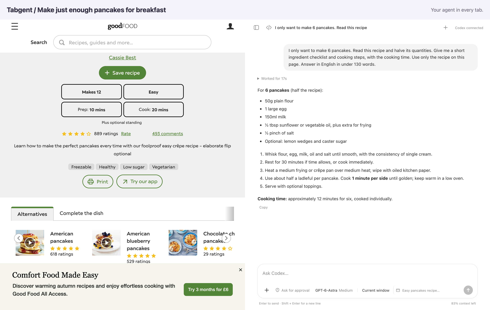
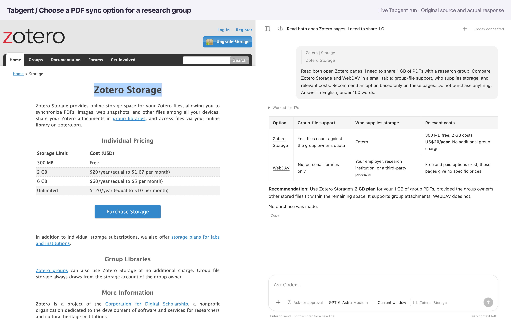

# Tabgent user guide

[← Home](../README.md) · **English** · [简体中文](features.zh-CN.md)

Start with a page you already use and tell Tabgent what you need. These examples cover cooking, days out, documents and website tasks. Adapt the questions to your own plans.

[Real examples](#cook-for-your-household) · [PDFs](#work-with-pdfs) · [Attachments and page context](#give-tabgent-the-right-context) · [Chat history](#keep-your-chats-connected) · [Task controls](#guide-a-task-as-it-runs) · [Settings and export](#make-it-fit-your-work)

## Cook for your household

The recipe makes twelve pancakes; you only need six. Ask for adjusted quantities and a short checklist you can follow.

Source: [Good Food — Easy pancakes](https://www.bbcgoodfood.com/recipes/easy-pancakes)



Ask Tabgent:

> I only want to make 6 pancakes. Read this recipe and halve its quantities. Give me a short ingredient checklist and cooking steps, with the cooking time. Use only the recipe on this page. Answer in English in under 130 words.

Open the recipe and ask, or select its ingredient list first. Follow up to convert units or make a shopping list.

## Plan a day out

Open two museums’ websites, give your child’s age, and compare admission, booking requirements and activities for children.

Source: [V&A South Kensington](https://www.vam.ac.uk/south-kensington/visit) · [Young V&A](https://www.vam.ac.uk/young)


Ask Tabgent:

> I am choosing between V&A South Kensington and Young V&A for a family day out with a 7-year-old. Read these open official pages. Compare free admission, booking requirements and what children can do. Recommend one based on these pages and link to visitor information. Do not book anything. Answer in English in under 150 words.

Keep the official pages in one browser window and choose Current window. Check the latest details before travelling; this example makes no bookings.

## Work with PDFs

Ask about a difficult diagram with the paper beside it, then highlight the passage you want to return to.

Source: Vaswani et al., [Attention Is All You Need](https://arxiv.org/abs/1706.03762), page 3, Figure 1.


Ask Tabgent:

> Read page 3 of this paper, including Figure 1. Explain the encoder and decoder in plain English, and why the decoder has masked attention. Highlight the selected passage on page 3. Keep the explanation under 130 words.

Select PDF text to ask about a specific passage. After annotating, use the viewer’s download button to keep your edits. Scanned documents may not have selectable text. You can switch to Chrome’s viewer if a PDF will not open, but precise highlighting needs Tabgent’s PDF viewer. Uploading an attachment lets you discuss it; it does not automatically open the annotation viewer. The paper belongs to its original authors.

### Link to a passage

A PDF link can include a page and an exact phrase. Opening it in Tabgent locates the phrase with a temporary search highlight:

```text
https://example.com/paper.pdf#page=3&search=ENCODED_TEXT&phrase=true
```

Replace `ENCODED_TEXT` with the original passage encoded using `encodeURIComponent`. Keep any query parameters before `#`. The page sets the starting location; the search can match text elsewhere in the document. This does not add a saved annotation. PDFs without searchable text may not produce a match.

## Understand a help page

When a help page is long, ask what to check first. This example explains why Zotero references can sync while PDF attachments remain missing.

Source: [Zotero — Syncing](https://www.zotero.org/support/sync)


Ask Tabgent:

> I have Zotero on two computers, but my PDFs are missing on the second one. Read this official page: what is the difference between data sync and file sync, and does the 300 MB limit apply to my references? Give me three practical checks, in English, under 130 words.

## Compare services across tabs

Price is only part of choosing a service. Here, Tabgent compares Zotero Storage and WebDAV for sharing 1 GB of PDFs with a research group.

Source: [Zotero Storage](https://www.zotero.org/storage) · [Syncing](https://www.zotero.org/support/sync)



Ask Tabgent:

> Read both open Zotero pages. I need to share 1 GB of PDFs with a research group. Compare Zotero Storage and WebDAV in a small table: group-file support, who supplies storage, and relevant costs. Recommend an option based only on these pages. Do not purchase anything. Answer in English, under 150 words.

## Let Tabgent search a website

Know your search criteria but don’t want to set every field yourself? Ask Tabgent to enter a title and year in arXiv’s advanced search and find the matching paper.

Source: [arXiv Advanced Search](https://arxiv.org/search/advanced)


Ask Tabgent:

> Use this arXiv search form to find the original 2020 paper whose title contains Retrieval-Augmented Generation. Set the title field and the year, then run the search. Report the matching title and link in English. Do not use another search service.

## Give Tabgent the right context

- **Ask about a passage:** Select text on the page, then ask your question in the sidebar. You can also right-click selected text and choose **Quote in Agent** to bring it into the conversation.
- **Check the target page:** The tab indicator beside the message box shows which page your next message refers to. Open its details before sending if several tabs share the conversation.
- **Add your own material:** Use the attachment button, paste a file or image, or drag it into the message box. Images can be previewed; PDF, DOCX and text attachments can be read alongside the page. Each message supports up to 10 files, up to 10 MiB each. Scanned PDFs may not contain readable text.
- **Let it use the live website:** Tabgent can read page content and inspect screenshots, click controls, type into forms, select options, scroll and move between pages. Its mouse actions show a virtual pointer. Website support varies.

## Keep your chats connected

Open **Page chats** to find conversations associated with the current URL. Sending a message associates that page with the conversation; simply navigating to a page does not. If you discuss several URLs in the same conversation, you can find it from each of those pages. Empty chats are not listed.

When opening a link creates a related conversation, the original chat links to the new one, and the new chat links back. Click the conversation name to switch to its tab. These links help you follow the work across pages; they do not copy the complete parent conversation into the new one. Returning to the original tab after a browser restart may not be available.

Click **+** in the Agent header to start a fresh chat on the same page. Use the open-in-new-page button to give the current chat more room in the full-page Agent view.

## Guide a task as it runs

- **See progress:** Expand the activity record to inspect the steps and tool activity. When a task has a plan, its progress appears in the conversation.
- **Queue a follow-up:** Send another instruction while the assistant is working. You can edit or delete queued messages before they run.
- **Change direction now:** Use **Steer** to send the instruction into the current task instead of waiting for the next one.
- **Stop:** Click the stop button. This does not undo actions already completed.
- **Plan first:** Enter `/plan` to switch to Plan mode, then describe the task. Use it again to leave Plan mode.
- **Work toward a goal:** Enter `/goal` to set an objective and an optional token budget. The goal controls let you inspect progress, edit, pause, resume or clear it. Goal support depends on your Codex version.

## Make it fit your work

**Model and reasoning.** Open the model selector beside the message box to choose a model and its reasoning effort. Available choices come from your Codex setup.

**Approvals and browser access.** Choose **Ask for approval**, **Approve for me** or **Full access**. Separately, choose **Current window** or **All windows** for browser actions. The window choice does not restrict other Codex tools or connected services. See [Privacy & permissions](privacy.md) for the boundaries of each setting.

**Skills and other tools.** Type `/skills` to browse and manage available skills, or `$` to select a skill for your message. Native Codex tools, including web search, and configured apps or MCP integrations can also be available in the conversation. Availability depends on your Codex version, model, permissions and configuration; Tabgent does not automatically connect new services for you.

**Keep the result.** Use **Copy** beneath an answer, or `/export` to download the conversation's user and assistant messages as Markdown. The export is text, not a backup of attachments or a browser recording. Use `/rename` to give the chat a recognizable name. Responses can display formatted tables, code and mathematical formulas.

**Manage longer conversations.** `/status` shows model and context usage information when available. `/compact` asks Codex to compact the conversation so you can continue with less context occupied.

<details>
<summary>How were these examples made?</summary>

Examples use real websites and actual conversations, run separately in English and Chinese. Screenshots place the page and conversation side by side without prewritten answers or replaced website content. Sources retain their original language and may change.

[cooking](assets/en/cooking.json) · [travel](assets/en/travel.json) · [pdf](assets/en/pdf.json) · [read](assets/en/read.json) · [compare](assets/en/compare.json) · [act](assets/en/act.json)

Maintainers can use [scripts/readme-screenshots.cjs](../scripts/readme-screenshots.cjs) to rerun these tasks. This requires signed-in Codex and the installed connector, performs real tasks and uses model quota.

```sh
TABGENT_EXAMPLE=cooking TABGENT_LANGUAGE=en node scripts/readme-screenshots.cjs
```

</details>
