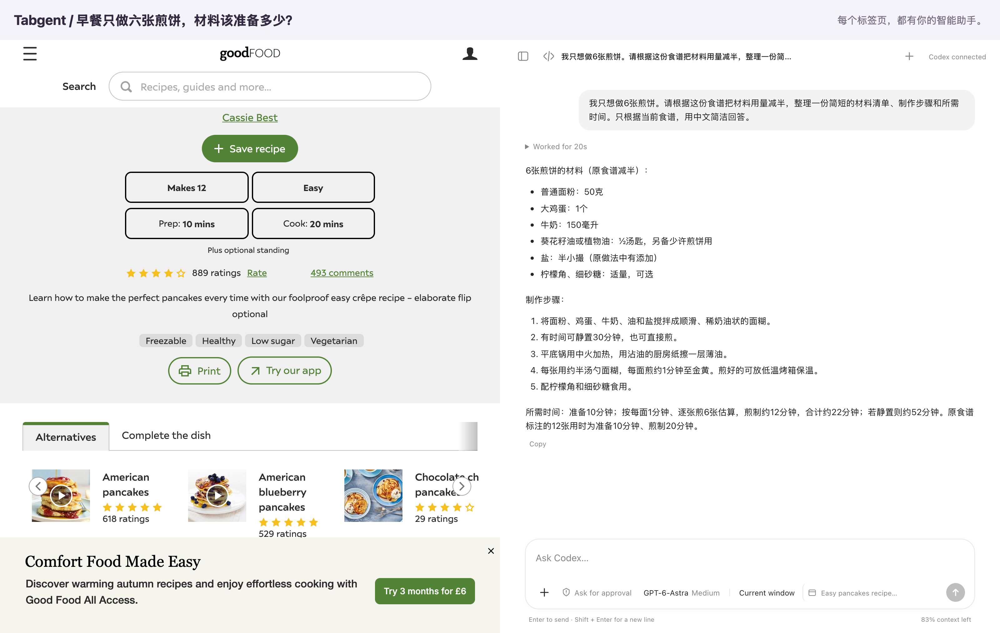
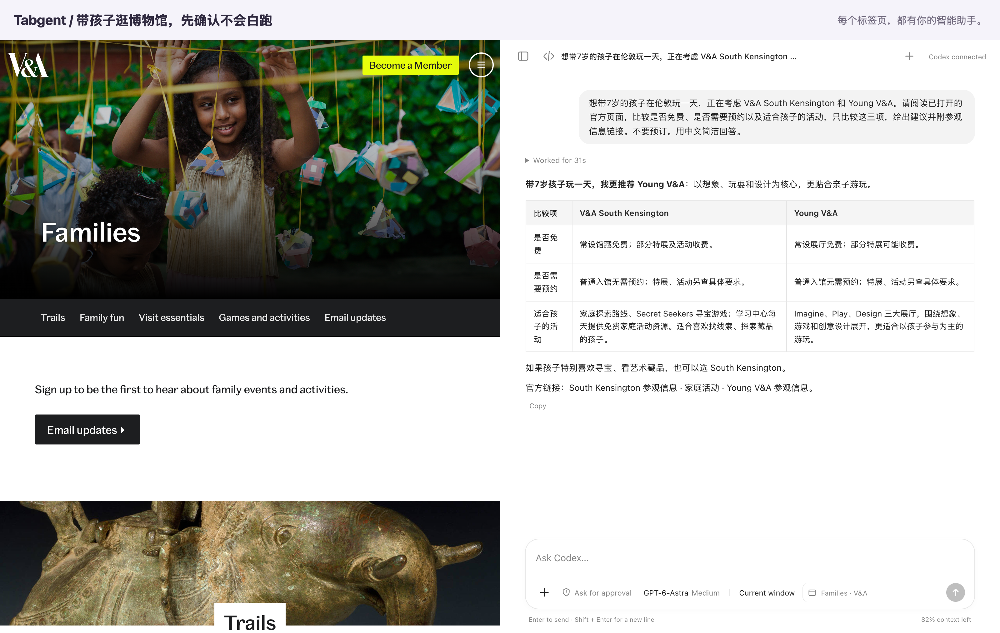
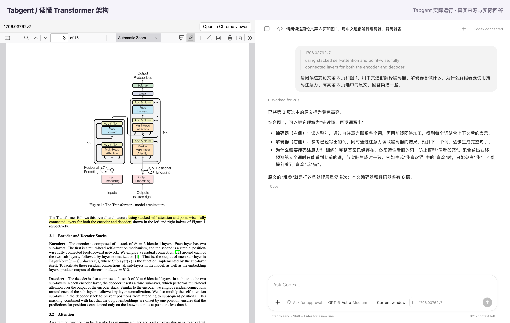
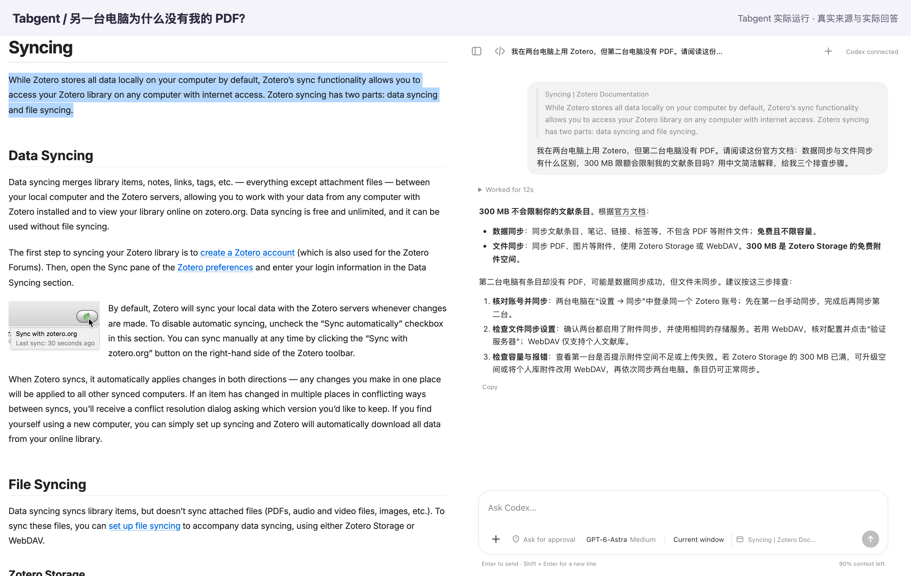
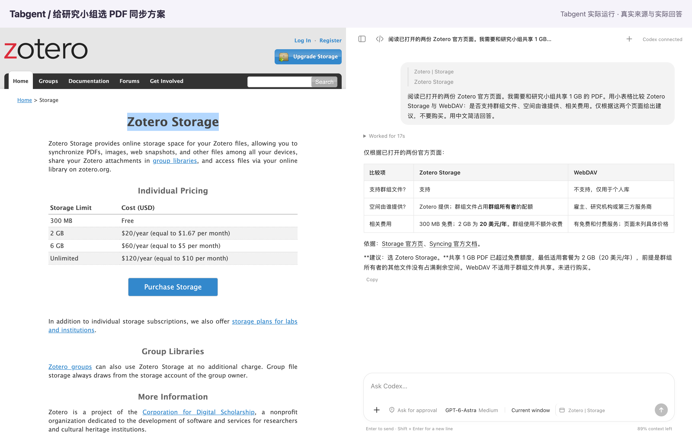
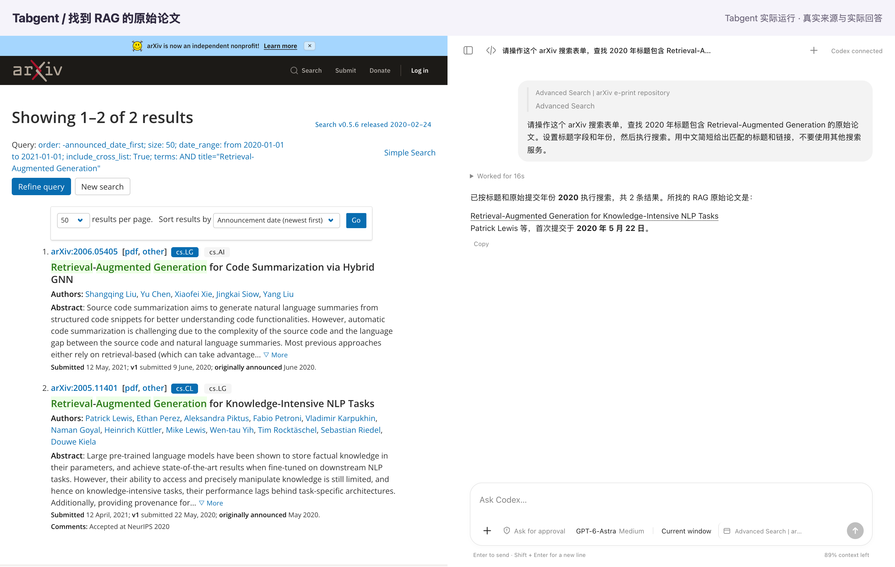

# Tabgent 使用指南

[← 首页](../README.zh-CN.md) · [English](features.md) · **简体中文**

从你正在使用的网页开始，告诉 Tabgent 你想解决的问题。下面通过食谱、出游、PDF 和网站搜索等示例，介绍具体用法。

[实际示例](#按家里的人数调整食谱) · [PDF](#使用-pdf) · [附件与网页上下文](#把相关材料一起交给助手) · [会话历史](#让网页和会话保持关联) · [任务控制](#任务进行中也能随时调整) · [设置与导出](#按你的习惯使用)

## 按家里的人数调整食谱

食谱能做十二张煎饼，但你只需要六张。让助手换算用量，把步骤整理得更容易照着做。

来源：[Good Food — Easy pancakes](https://www.bbcgoodfood.com/recipes/easy-pancakes)



可以这样问：

> 我只想做6张煎饼。请根据这份食谱把材料用量减半，整理一份简短的材料清单、制作步骤和所需时间。只根据当前食谱，用中文简洁回答。

打开食谱后直接提问，也可以先选中材料表。需要换算单位或列购物清单时，继续补充要求即可。

## 安排一次出游

把两家博物馆官网打开，告诉助手孩子的年龄和你关心的条件，请它比较门票、预约要求和适合孩子的活动。

来源：[V&A South Kensington](https://www.vam.ac.uk/south-kensington/visit) · [Young V&A](https://www.vam.ac.uk/young)



可以这样问：

> 想带7岁的孩子在伦敦玩一天，正在考虑 V&A South Kensington 和 Young V&A。请阅读已打开的官方页面，比较是否免费、是否需要预约以及适合孩子的活动，只比较这三项，给出建议并附参观信息链接。不要预订。用中文简洁回答。

把官网放在同一个浏览器窗口，选择 Current window（当前窗口）。出行前再次确认最新信息；这个例子不进行预约。

## 使用 PDF

看不懂论文里的架构图？可以让助手结合原文解释，并把关键段落高亮留在文档里。

来源：Vaswani 等人，《[Attention Is All You Need](https://arxiv.org/abs/1706.03762)》，第 3 页图 1。



可以这样问：

> 请阅读这篇论文第 3 页和图 1，用中文通俗解释编码器、解码器各做什么，为什么解码器要使用掩码注意力。高亮第 3 页选中的原文，回答简洁一些。

选中 PDF 文字后提问，助手能结合页码定位。完成标注后，请使用阅读器的下载按钮保存。图片扫描件可能无法准确选中文字；阅读器无法打开时，可以切换到 Chrome 阅读器，但精确高亮需要 Tabgent 的 PDF 阅读器。上传附件可以用于阅读，但不会自动打开标注阅读器。论文版权归原作者所有。

### 点击引用查看原文

PDF 链接可以携带页码和原文片段。在 Tabgent 中打开后，会定位文字并显示临时搜索高亮：

```text
https://example.com/paper.pdf#page=3&search=ENCODED_TEXT&phrase=true
```

将 `ENCODED_TEXT` 替换为经过 `encodeURIComponent` 编码的原文，原网址的查询参数保留在 `#` 前。页码指定查找的起始位置，不会把搜索限定在这一页。这不会写入永久标注；没有可搜索文字的扫描件可能无法匹配。

## 读懂网页里的说明

软件出了问题，帮助文档又很长。这个例子让助手解释 Zotero 的文献同步与附件同步，并给出排查步骤。

来源：[Zotero — Syncing](https://www.zotero.org/support/sync)



可以这样问：

> 我在两台电脑上用 Zotero，但第二台电脑没有 PDF。请阅读这份官方文档：数据同步与文件同步有什么区别，300 MB 限额会限制我的文献条目吗？用中文简洁解释，给我三个排查步骤。

## 对比不同方案

选方案时，价格之外还有使用条件。这里比较研究小组共享 1 GB PDF 时，Zotero Storage 与 WebDAV 是否适合。

来源：[Zotero Storage](https://www.zotero.org/storage) · [Syncing](https://www.zotero.org/support/sync)



可以这样问：

> 阅读已打开的两份 Zotero 官方页面。我需要和研究小组共享 1 GB 的 PDF。用小表格比较 Zotero Storage 与 WebDAV：是否支持群组文件、空间由谁提供、相关费用。仅根据这两个页面给出建议，不要购买。用中文简洁回答。

## 让助手操作网站搜索

知道搜索条件，却不想逐项设置？把标题关键词和年份交给助手，让它操作 arXiv 的高级搜索，找到对应论文。

来源：[arXiv Advanced Search](https://arxiv.org/search/advanced)



可以这样问：

> 请操作这个 arXiv 搜索表单，查找 2020 年标题包含 Retrieval-Augmented Generation 的原始论文。设置标题字段和年份，然后执行搜索。用中文简短给出匹配的标题和链接，不要使用其他搜索服务。

## 把相关材料一起交给助手

- **针对原文提问：** 在网页选中文字，再到侧边栏提问。也可以右键点击选中的文字，使用 **Quote in Agent（引用到助手）** 把它带入对话。
- **确认正在讨论哪个页面：** 输入框旁的标签页图标显示下一条消息对应的页面。如果多个标签页共用一个会话，可以在发送前点击查看详情。
- **附上自己的材料：** 点击附件按钮，粘贴文件或图片，或直接拖入输入框。图片支持预览；PDF、DOCX 和文本附件可以结合网页一起阅读。每条消息最多附加 10 个文件，每个不超过 10 MiB。扫描版 PDF 可能没有可读取的文字。
- **直接使用网站：** Tabgent 可以读取网页、查看截图、点击控件、填写表单、选择选项、滚动和切换页面。鼠标操作时会显示虚拟指针。不同网站的支持情况可能不同。

## 让网页和会话保持关联

打开 **Page chats（网页会话）**，查看与当前网址关联的对话。发送消息时，该网页才会与会话建立关联；仅仅切换网页不会建立关联。同一个会话里聊过多个网址，就能从这些网页各自的历史列表找到它。列表不显示空会话。

从链接打开新标签页并产生关联会话时，原会话会记录新会话，新会话也会显示自己的来处。点击会话名称即可切换到对应标签页。这样能顺着网页找回之前的工作，但不会把原会话的全部内容复制进新会话。浏览器重启后，可能无法自动回到原来的标签页。

点击 Agent 顶部的 **+**，在当前页面开始新会话。需要更多阅读空间时，点击展开到新页面的按钮，在完整的 Agent 页面继续当前对话。

## 任务进行中也能随时调整

- **查看进度：** 展开活动记录，查看执行步骤和工具活动。任务包含计划时，对话中也会展示计划进度。
- **排队补充：** 助手工作时可以继续发送要求；待发送消息可以编辑或删除。
- **立即调整：** 使用 **Steer** 把要求交给当前任务，不必等下一轮。
- **停止：** 点击停止按钮。已经完成的操作不会因此撤销。
- **先梳理计划：** 输入 `/plan` 切换到计划模式，再描述任务。再次使用可退出计划模式。
- **围绕目标继续工作：** 输入 `/goal` 设置目标和可选的 token 用量上限。目标控件支持查看进度、修改、暂停、恢复或清除。此功能需要你的 Codex 版本支持。

## 按你的习惯使用

**模型与思考强度。** 点击输入框旁的模型选择器，在同一个菜单中选择模型及思考强度。可用选项来自你的 Codex 配置。

**批准方式与浏览器范围。** 可以选择 **Ask for approval（请求批准）**、**Approve for me（代为审批）** 或 **Full access（完全访问）**。浏览器操作范围另行选择 **Current window（当前窗口）** 或 **All windows（所有窗口）**；这项范围设置不限制 Codex 的其他工具和已连接服务。各项设置的边界详见[隐私与权限](privacy.md)。

**技能和其他工具。** 输入 `/skills` 浏览及管理可用技能，或输入 `$` 为消息选择技能。会话也可以使用 Codex 原生工具（包括网页搜索），以及已配置的应用或 MCP 集成。具体取决于 Codex 版本、模型、权限和配置；Tabgent 不会自动替你连接新的服务。

**保留结果。** 点击回答下方的 **Copy（复制）**，或输入 `/export`，将会话里的用户消息和助手回答下载为 Markdown。导出内容是文本，不包含附件备份或浏览器录像。输入 `/rename` 可以给会话起一个容易辨认的名字。回答支持展示表格、代码和数学公式。

**管理较长的对话。** `/status` 可查看模型及可用的上下文用量信息；`/compact` 会请 Codex 压缩对话上下文，减少继续聊天时占用的空间。

<details>
<summary>这些示例是怎样制作的？</summary>

示例来自真实网页和实际会话，中英文分别运行。截图将网页和对应会话并排展示，未预写回答或替换网页内容。网页保留原文，信息可能更新。

[食谱换算记录](assets/zh-CN/cooking.json) · [亲子出游记录](assets/zh-CN/travel.json) · [PDF 阅读记录](assets/zh-CN/pdf.json) · [文档排查记录](assets/zh-CN/read.json) · [方案比较记录](assets/zh-CN/compare.json) · [网站搜索记录](assets/zh-CN/act.json)

维护者可用[scripts/readme-screenshots.cjs](../scripts/readme-screenshots.cjs)重新运行。需要已登录的 Codex 和已安装的连接器，会执行真实任务并消耗模型用量。

```sh
TABGENT_EXAMPLE=cooking TABGENT_LANGUAGE=zh-CN node scripts/readme-screenshots.cjs
```

</details>
